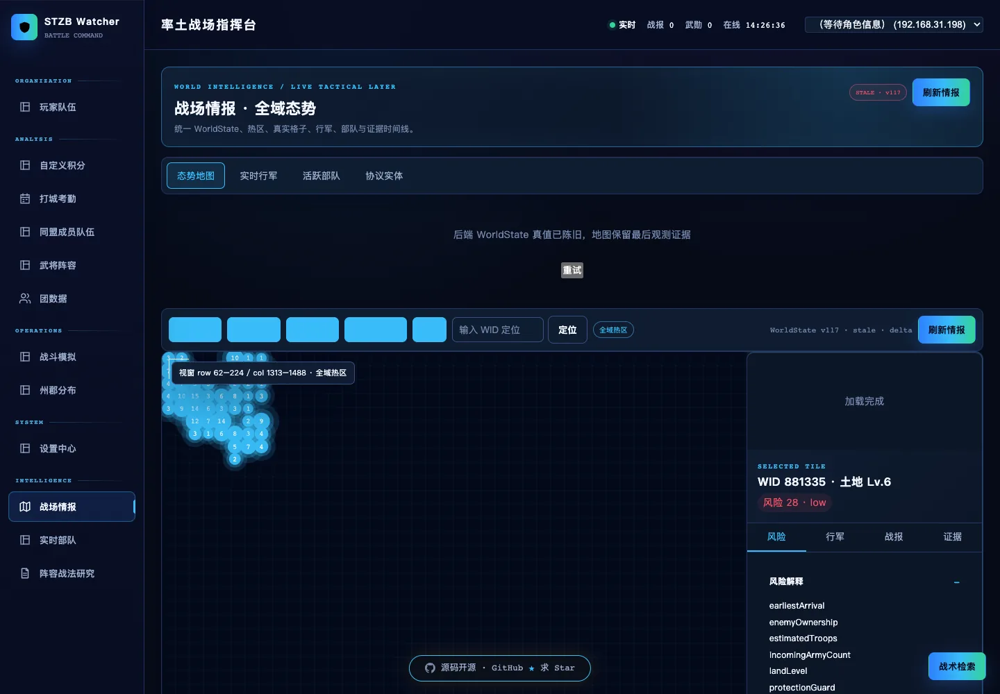
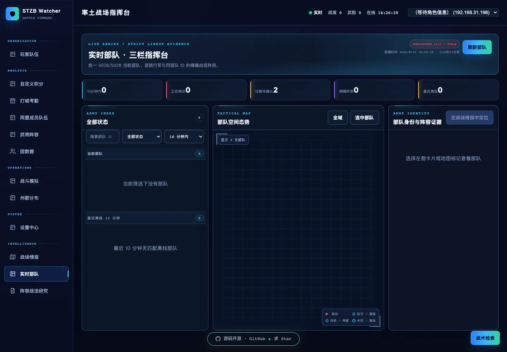
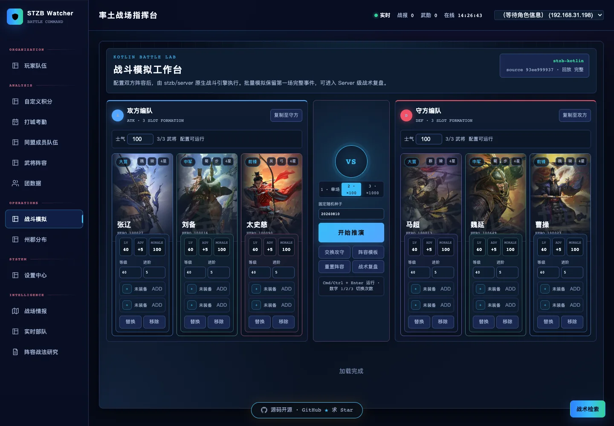
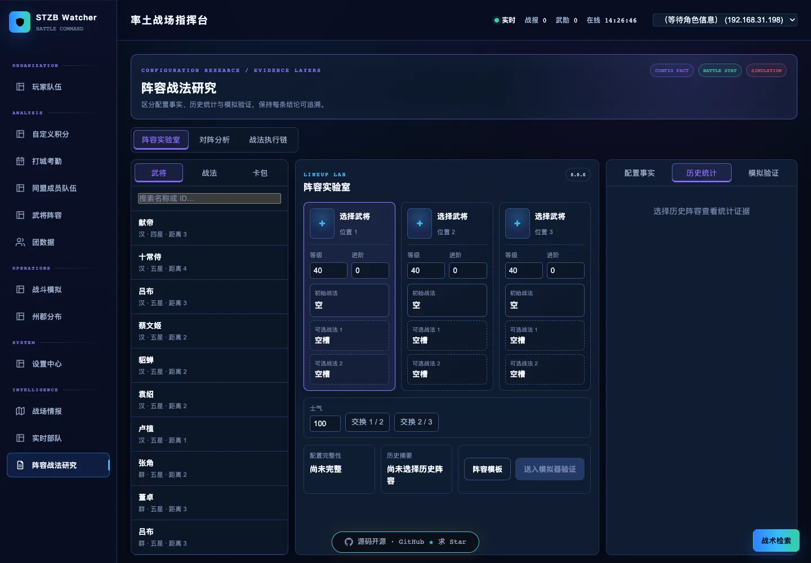
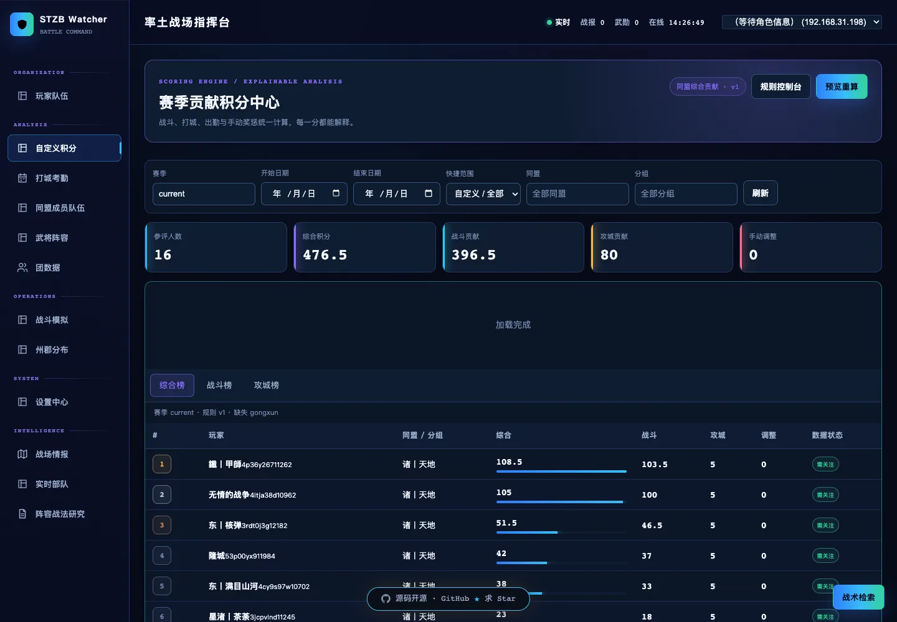
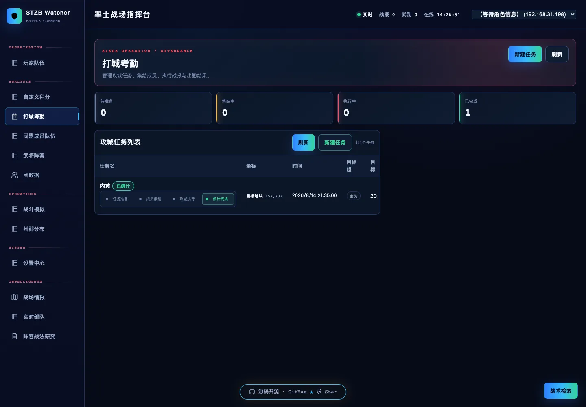
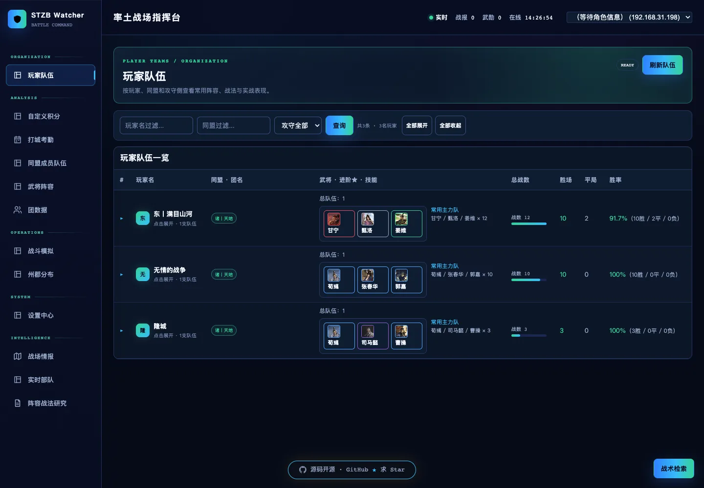
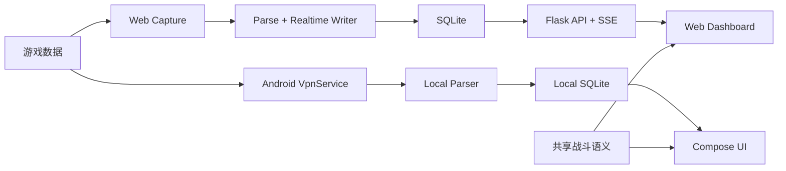

<div align="center">

# stzb_watcher

### 《率土之滨》Web + Android 双端战场数据平台

从本地战场数据采集到态势研判、队伍研究、团队管理与战斗模拟，
Web 与 Android 使用一致的数据口径和业务语义，覆盖同一套核心能力。


[产品预览](#产品预览) · [核心能力](#核心能力) · [快速开始](#快速开始) · [项目结构](#项目结构)

</div>

---

## 双端产品

`stzb_watcher` 将战场采集、实时部队、战报分析、玩家队伍、团队协作、积分考勤、
阵容研究与战斗模拟整合为一套本地优先的数据平台。

| Web | Android |
|---|---|
| 面向桌面宽屏的高密度指挥与多面板分析 | 面向移动设备的触控操作与本机运行 |
| Flask API、SSE 与浏览器仪表盘 | VpnService、本地解析、SQLite 与 Compose |
| 适合持续监控、横向比较与团队管理 | 适合随身采集、快速查看与移动决策 |

两端的差异只在交互载体和运行方式。核心数据模型、业务口径、阵容语义与模拟结果
保持一致，不区分主端与次端。

## 产品预览

### Web 全景

> **截图待上传：Web 战场情报全景**
>
> 文件名：`docs/assets/screenshots/overview-intelligence.webp`
>
> 建议画面：完整侧栏、顶栏、战场地图、图层控制与情报区域。

<!--

-->

截图上传与启用方法见
[`docs/assets/screenshots/README.md`](docs/assets/screenshots/README.md)。

## 核心价值

| 场景 | 能力 |
|---|---|
| 战场态势统一 | 将地图格子、行军、实时部队、战报与世界事件汇聚到同一视图 |
| 实时行动判断 | 追踪部队位置、路线、目标、新鲜度与阵容证据，减少信息切换 |
| 阵容研究推演 | 结合历史样本、武将战法资料与 Kotlin 战斗引擎验证对阵方案 |
| 团队协同管理 | 统一查看成员队伍、团数据、攻城考勤、自定义积分与赛季表现 |
| 本地数据闭环 | Web 与 Android 均可在本地完成采集、解析、存储与查询 |

## Web 功能画廊

<table>
  <tr>
    <td width="50%" align="center">
      <!--  -->
      <strong>截图待上传</strong><br>
      <code>gallery-live-army.webp</code><br><br>
      <strong>实时部队</strong><br>
      聚合位置、路线、目标和精确战报阵容，形成三栏指挥视图。
    </td>
    <td width="50%" align="center">
      <!--  -->
      <strong>截图待上传</strong><br>
      <code>gallery-simulator.webp</code><br><br>
      <strong>战斗模拟</strong><br>
      配置攻守阵容，执行单场或批量推演，并查看语义事件回放。
    </td>
  </tr>
  <tr>
    <td width="50%" align="center">
      <!--  -->
      <strong>截图待上传</strong><br>
      <code>gallery-research.webp</code><br><br>
      <strong>阵容战法研究</strong><br>
      连接历史对阵、战法执行链与模拟结果，验证阵容思路。
    </td>
    <td width="50%" align="center">
      <!--  -->
      <strong>截图待上传</strong><br>
      <code>gallery-score.webp</code><br><br>
      <strong>自定义积分</strong><br>
      按赛季规则计算榜单，支持筛选、调整、重算与规则管理。
    </td>
  </tr>
  <tr>
    <td width="50%" align="center">
      <!--  -->
      <strong>截图待上传</strong><br>
      <code>gallery-attendance.webp</code><br><br>
      <strong>打城考勤</strong><br>
      管理任务阶段、成员安排与攻城出勤，统一团队执行记录。
    </td>
    <td width="50%" align="center">
      <!--  -->
      <strong>截图待上传</strong><br>
      <code>gallery-player-teams.webp</code><br><br>
      <strong>玩家队伍</strong><br>
      按玩家、同盟和攻守侧查看常用阵容、战法与实战表现。
    </td>
  </tr>
</table>

## Android 产品预览

<table>
  <tr>
    <td width="33%" align="center">
      <!--  -->
      <strong>截图待上传</strong><br>
      <code>android-battlefield.webp</code>
    </td>
    <td width="33%" align="center">
      <!--  -->
      <strong>截图待上传</strong><br>
      <code>android-teams.webp</code>
    </td>
    <td width="33%" align="center">
      <!--  -->
      <strong>截图待上传</strong><br>
      <code>android-simulator.webp</code>
    </td>
  </tr>
  <tr>
    <td align="center"><strong>战场总览</strong><br>查看与 Web 一致的战场动态、筛选和状态信息。</td>
    <td align="center"><strong>队伍与团队</strong><br>访问同一套玩家队伍、成员统计与团队业务数据。</td>
    <td align="center"><strong>战斗模拟</strong><br>复用一致的阵容配置、战斗语义与推演能力。</td>
  </tr>
</table>

## 核心能力

| 能力域 | 主要能力 | Web | Android |
|---|---|:---:|:---:|
| 战场 | 战场情报、地图格子、行军、实时部队、世界事件 | 支持 | 支持 |
| 战报 | 完整战报、详情、筛选、通知与衍生统计 | 支持 | 支持 |
| 队伍 | 玩家队伍、同盟成员队伍、武将阵容与表现 | 支持 | 支持 |
| 团队 | 团数据、成员管理、打城考勤、自定义积分 | 支持 | 支持 |
| 分析 | 排行、州郡分布、阵容研究与对阵证据 | 支持 | 支持 |
| 模拟 | 双方配置、批量推演、结果与事件回放 | 支持 | 支持 |
| 系统 | 本地采集、SQLite、多档案、导出与设置 | 支持 | 支持 |

Web 侧重宽屏指挥密度和多区域联动；Android 侧重移动交互、本机抓包和离线访问。

## 功能总览

Web 的 12 个主导航页面按五个业务域组织：

| 业务域 | 页面 |
|---|---|
| 情报 | 战场情报、实时部队 |
| 行动 | 玩家队伍、打城考勤、州郡分布 |
| 组织 | 同盟成员队伍、团数据、自定义积分 |
| 分析 | 武将阵容、阵容战法研究、战斗模拟 |
| 系统 | 设置中心 |

Android 一级导航为“战场、队伍、团队、模拟、更多”，以移动端结构承载同一套业务
能力和本地数据。

## 快速开始

### Web

环境要求：

- Python 3.9+
- JDK 17
- 支持现代 JavaScript、Canvas 与 SSE 的 Chrome 或 Chromium 浏览器

```bash
git clone <your-repository-url>
cd stzb_watcher

python3 -m venv .venv
source .venv/bin/activate
pip install -r requirements.txt

./gradlew -p battle-engine test installDist
python api_server.py
```

启动后访问 [http://127.0.0.1:8080](http://127.0.0.1:8080)。服务会初始化数据结构，
启动本地采集与实时写入，并托管 Web 仪表盘。

如果服务需要被局域网中的其他设备访问，建议保护写接口：

```bash
export STZB_API_TOKEN='请替换为随机长字符串'
python api_server.py
```

### Android

环境要求：

- Android Studio 或命令行 Android SDK
- Android SDK 35
- Android 13+（`minSdk 33`）
- JDK 17
- NDK `26.3.11579264`，用于构建本机 VPN/SOCKS5 桥接

```bash
cd astzb
bash check_android_env.sh
./gradlew :app:assembleDebug
```

Debug APK 生成于：

```text
astzb/app/build/outputs/apk/debug/app-debug.apk
```

Android 端通过 VpnService、本机解析器与 SQLite 独立运行，不依赖 PC Flask 服务。

## 数据与隐私

本项目采用本地优先的数据策略：

- Web 原始数据默认写入 `capture_new/`，业务数据保存在本地 SQLite；
- Android 数据保存在 App 私有目录中的本地 SQLite，并支持本机导出；
- `current_profile.json` 与 `profiles.json` 可能包含角色、区服和本机路径；
- 数据库、运行态账号文件、日志和抓包文件均不应提交到 Git；
- 上传 README 截图前，请自行检查并遮挡不希望公开的账号信息；
- 对外或局域网部署 Web 服务时，应设置 `STZB_API_TOKEN`。

## 技术架构



| 层级 | 技术 |
|---|---|
| Web | Python、Flask、SQLite、Vanilla JavaScript、Canvas、SSE |
| Android | Kotlin、Jetpack Compose、VpnService、SQLite、NDK |
| 实时链路 | Scapy / SOCKS5 捕获、报文解析、增量写入 |
| 战斗能力 | Kotlin/JVM 17 战斗引擎与一致的模拟语义 |

进阶设计与调研资料：

- [设计规格](docs/superpowers/specs/)
- [实施计划](docs/superpowers/plans/)
- [协议与迁移调研](docs/research/)

## 项目结构

```text
stzb_watcher/
├── api_server.py             # Web 服务、API 与启动入口
├── scrapy_v2.py              # Web 抓包与报文解析
├── realtime_writer.py        # 实时写库与事件推送
├── static/                   # Web 产品页面与前端资源
├── intelligence/             # 战场情报与阵容分析
├── score_center/             # 赛季积分业务
├── world_scene/              # 世界场景读模型
├── battle-engine/            # Kotlin 战斗引擎运行镜像
├── astzb/                    # Android 客户端
├── data/intelligence/        # 版本化情报快照
├── docs/                     # 设计、计划、调研与截图说明
└── test/                     # Node、Python 与 Chrome 测试
```

## 验证

Web 前端与纯逻辑测试：

```bash
node --test test/js/*.test.mjs
```

Python API、数据模型、静态契约与系统 Chrome E2E：

```bash
PYTHONPYCACHEPREFIX=/private/tmp/stzb-pycache \
  .venv/bin/python -m unittest discover -s test -v
```

Android 单元测试与构建：

```bash
cd astzb
./gradlew testDebugUnitTest :app:assembleDebug
```

## 许可与联系

本项目按 MIT License 使用。项目用于个人学习与团队内部数据管理，请遵守适用法律、
游戏服务条款与数据隐私要求。

问题反馈：QQ `3268276553`
